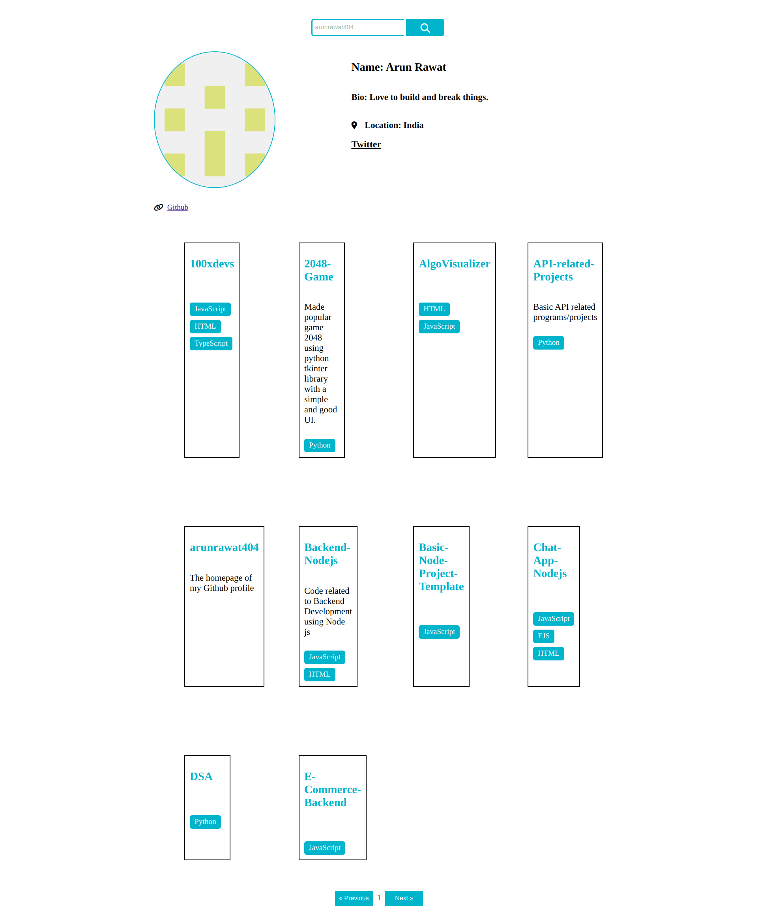

# GitHub Profile Search

## [Live](https://arunrawat404.github.io/Gtihub-Profile-Visualizer/)

This project allows users to search for GitHub profiles, fetching details such as username, bio, location, Twitter handle and repositories using the GitHub API. The project implements server-side pagination to retrieve 10 repositories at a time.

## Features

- Search for GitHub profiles
- Display basic user information (username, bio, location , Twitter handle)
- Fetch and display repositories (with name, description, and programming language)

## Technologies Used

- HTML
- CSS
- JavaScript

## How to Use

1. **Clone the repository:**

   ```bash
   git clone https://github.com/ArunRawat404/Gtihub-Profile-Visualizer.git
   ```

2. Open index.html in your web browser.

3. Enter a GitHub username in the search box and click the "Search" button.

4. View the user's basic information and repositories.

## Screenshots



